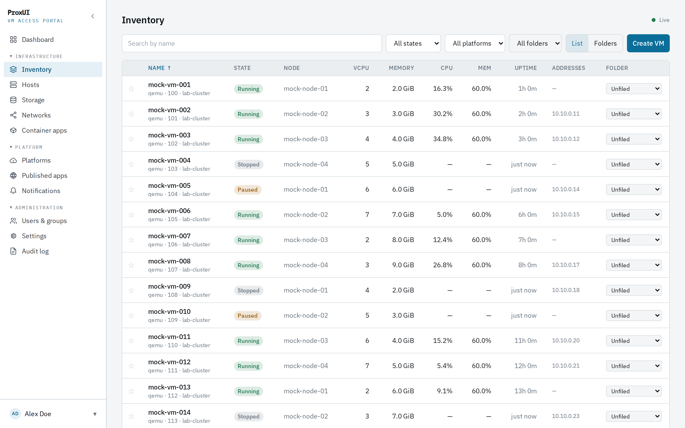
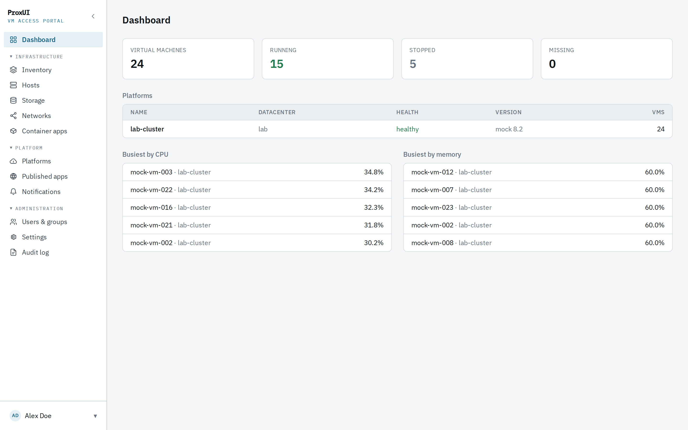
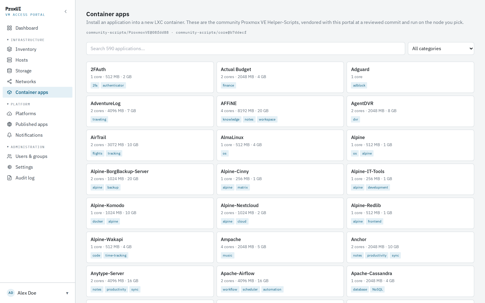
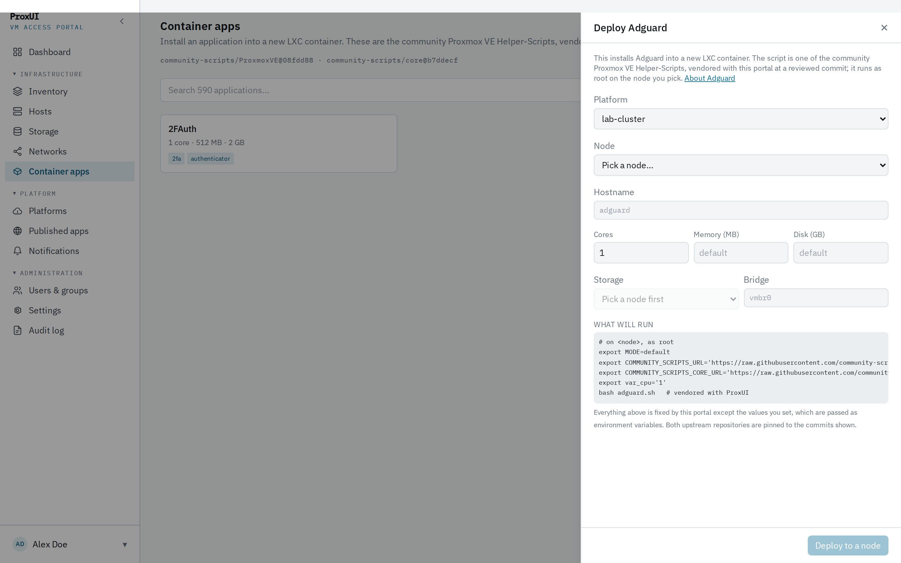
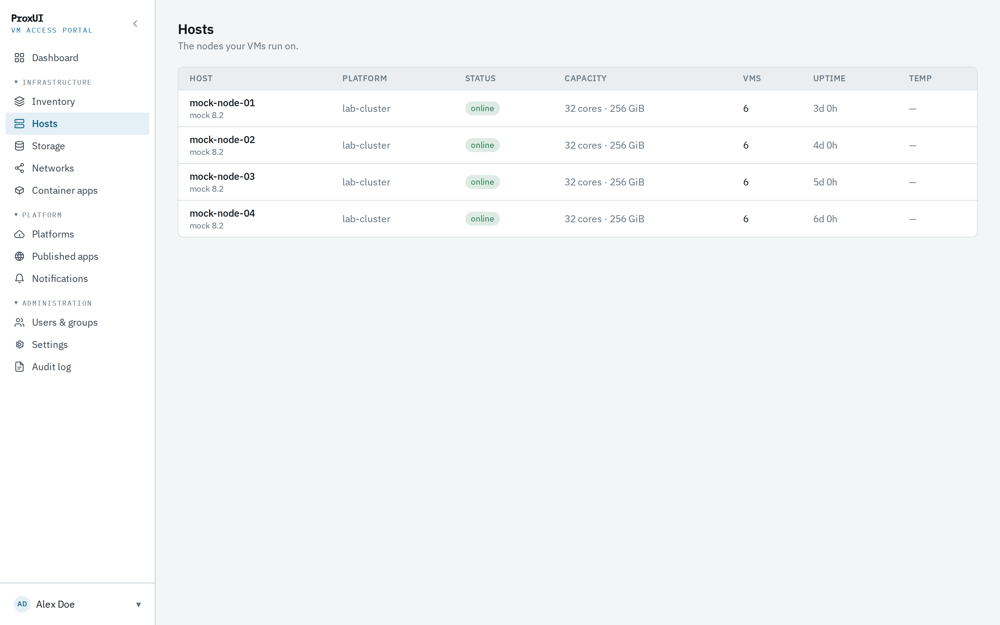
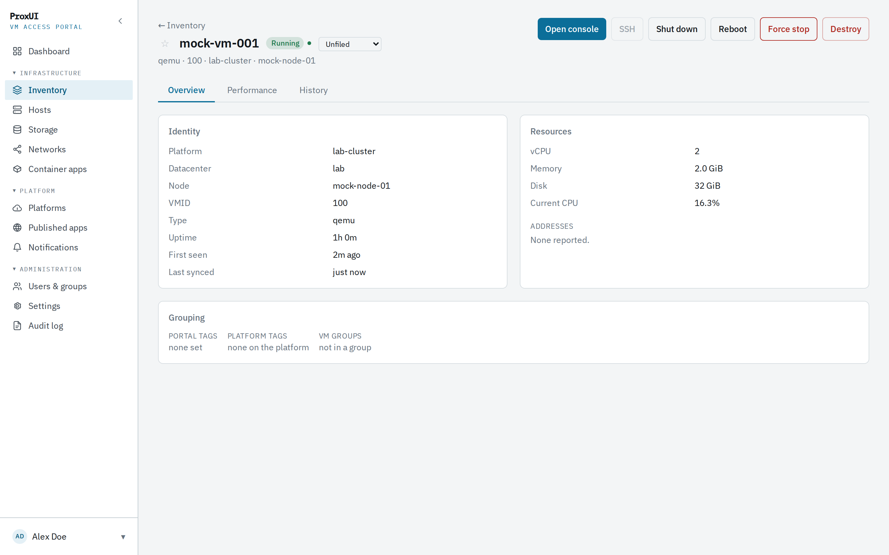
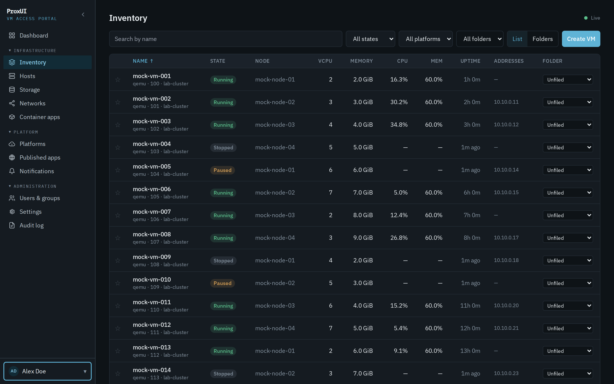

# ProxUI — VM Access Portal

Self-hosted web portal for virtualization estates: a permission-scoped dashboard for VM inventory, in-browser consoles and SSH, performance history, provisioning, and one-click application deployment — starting with Proxmox VE, extensible through a connector framework.

**Status:** v1.0.0-rc.1, running against a live Proxmox VE 9.2 cluster. See the [changelog](CHANGELOG.md) for what is done, what is measured, and what is knowingly missing.



## What it does

| | |
|---|---|
| **Inventory** | Every VM and container across your clusters, scoped by grant. Favourites sort to the top; personal folders group what you actually work on. Live-updating over WebSocket. |
| **Consoles and shells** | noVNC in the browser, proxied through the backend so nothing needs a route to the hypervisor. SSH with a file browser, and the guest credential is typed per session and [never stored](docs/29-ssh-terminal.md). |
| **Performance** | Per-VM and per-node history for a year, with node temperatures the Proxmox API [does not publish](docs/30-node-sensors.md). |
| **Provisioning** | Create a guest from a cloud-init template, or build the template itself from a published cloud image without touching a node. |
| **Container apps** | 590 applications installable into an LXC from a [vendored, commit-pinned catalogue](docs/31-container-apps.md). |
| **Publishing** | Expose a service to the internet through a Cloudflare Tunnel, picking the target from the inventory rather than typing an address. |
| **Operations** | RBAC to the VM, an append-only audit trail, notifications, alert rules, and a readiness check that tells a node what it is missing and offers to install it. |

### The estate at a glance



### Container apps

The community Proxmox VE Helper-Scripts, browsable and deployable from the portal. The scripts are **vendored in this repository at a reviewed commit** and both upstream repositories are pinned, so what runs as root on a hypervisor is a thing somebody approved rather than whatever a URL served that morning — and the dialog shows the exact command before it runs.





[ADR 0012](docs/adr/0012-the-portal-runs-a-vetted-catalogue-on-a-node.md) is the argument for why a VM portal should do this at all, and — more usefully — what it deliberately does not claim.

### Nodes, with temperatures

Proxmox publishes no temperature anywhere in its API. The portal reads them from the node itself — one fixed command over SSH with the portal's own key — because a chart with no line on it is not an answer.



### A VM

Everything about one machine in one place: what it is, what it is doing, and every way in.



### Light or dark, in two palettes

Appearance has two independent axes. **Mode** is light, dark or whatever the machine says; **theme** is the palette and typeface. Each theme defines every token in both modes, so choosing one never decides the other.



> The screenshots are taken against the built-in **mock connector** — the estate is `mock-vm-001`, `lab-cluster`, `10.10.0.x`. That is not a stylistic choice: publishing real VM names, node addresses and SSH host-key fingerprints to a public repository is not something a screenshot is worth. `make dev` seeds the same mock estate.

## Running it

```bash
cp .env.example .env          # set PROXUI_MASTER_KEY and the bootstrap admin
make dev                      # postgres+timescale, redis, api, vite
```

Then add a platform at `/platforms`: the form is built from the connector's own schema, and **Test connection** must pass before Save is enabled. [Adding a platform](docs/27-adding-a-platform.md) covers the Proxmox token and the privileges each feature needs.

```bash
make ci                 # everything CI enforces: tidy, lint, govulncheck, tests, build
make test-integration   # adds the database-backed tests
make gen-apps           # re-vendor the helper scripts at a newer pinned commit
```

Back up before upgrading — migrations are forward-only:

```bash
PROXUI_DATABASE_URL=postgres://... scripts/backup.sh
```

## What the portal does to your nodes

Most of the portal talks to the Proxmox API. Three things do not, because the API cannot answer them, and they are worth knowing about before you install this:

- **Node temperatures** are read over SSH with the portal's own key: one fixed command, never a shell ([ADR 0007](docs/adr/0007-the-portal-reads-node-sensors-over-ssh.md)).
- **Two packages** — `lm-sensors` and `libguestfs-tools` — can be installed by the portal from a list compiled into the binary ([ADR 0011](docs/adr/0011-the-portal-can-install-what-it-needs-on-a-node.md)).
- **Container apps** run a large third-party program as root ([ADR 0012](docs/adr/0012-the-portal-runs-a-vetted-catalogue-on-a-node.md)). This is the biggest step and the ADR is explicit about the part pinning does not solve.

In all three the request names an identifier and never a command, the node's host key must be pinned first, and the action is admin-only and audited.

## Stack (decided)

Go backend (Clean Architecture, single role-switchable binary) · React + TypeScript SPA · PostgreSQL 16 + TimescaleDB · Redis 7 + Asynq · Docker Compose deployment · built-in auth (argon2id / JWT / TOTP).

## Key documents

| | |
|---|---|
| [Design package index](docs/README.md) | the full design package, the ADR index, and locked stakeholder decisions |
| [Runbooks](docs/24-runbooks.md) | backup and restore, platform not syncing, consoles failing, lost master key |
| [Security checklist](docs/25-security-checklist.md) | ASVS L2 pass with evidence, and what is not met |
| [Changelog](CHANGELOG.md) | releases, measurements, known limitations |
| [Executive summary](docs/01-executive-summary.md) | what and why in two pages |
| [System architecture](docs/05-system-architecture.md) | layering, diagram, every tech decision with rationale |
| [Sprint plan](docs/20-roadmap-sprints.md) | 20 sprints, backend first |
| [CLAUDE.md](CLAUDE.md) | guide for AI coding agents working in this repo |
| [ADRs](docs/adr/) | decisions that deviate from the design, with reasoning |

## Third-party content

`internal/app/deploy/scripts/` vendors the [Proxmox VE Helper-Scripts](https://github.com/community-scripts/ProxmoxVE) (MIT) at a pinned commit. They are copied rather than fetched so that a change to what runs on a hypervisor arrives as a diff somebody reads. Regenerate with `make gen-apps` after moving the pin.
