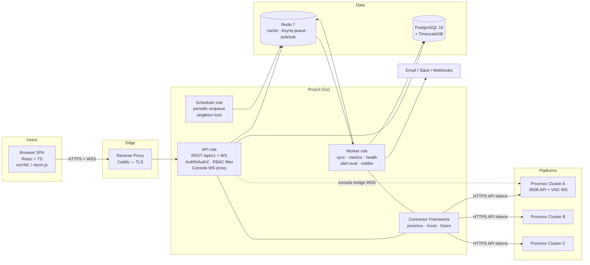

# 05 — System Architecture

## 5.1 Style: modular monolith, microservice-ready

ProxUI is a **single Go binary** structured with Clean Architecture layers and deployable in split roles. This is deliberate: at ≤ 500 VMs with a solo developer, microservices would multiply operational cost for zero benefit. The microservice *seams* exist (queue between API and workers, stateless API, connector isolation), so extraction later is a deployment change, not a rewrite.

```
cmd/proxui --role=all        # default: API + scheduler + workers in one process
cmd/proxui --role=api        # HTTP/WS only
cmd/proxui --role=worker     # queue consumers (sync, metrics, notify)
cmd/proxui --role=scheduler  # periodic enqueuer (Redis-lock singleton)
```

## 5.2 High-level architecture diagram



## 5.3 Layering (Clean Architecture)

```
┌──────────────────────────────────────────────────────┐
│ Interface:   HTTP handlers, WS handlers, CLI, jobs   │  internal/transport, internal/jobs
├──────────────────────────────────────────────────────┤
│ Application: commands & queries (CQRS), ports        │  internal/app/...
├──────────────────────────────────────────────────────┤
│ Domain:      entities, value objects, domain events, │  internal/domain/...
│              invariants — zero external imports      │
├──────────────────────────────────────────────────────┤
│ Infrastructure: Postgres repos, Redis, Asynq, SMTP,  │  internal/infra/...
│              Slack, crypto, connector implementations│  internal/connectors/...
└──────────────────────────────────────────────────────┘
```

**Dependency rule:** imports point inward only. `domain` imports nothing of ours; `app` imports `domain` and defines *ports* (interfaces); `infra` and `transport` import `app`/`domain` and are wired together in `cmd/` by constructor injection.

**Rationale for how the required patterns are applied (and right-sized):**

| Required pattern | Application here | Rationale |
|---|---|---|
| Clean Architecture | Strict import-direction rule enforced by lint (`depguard`) | Cheap in Go; keeps connectors and DB swappable, makes the domain unit-testable |
| DDD | Bounded contexts: Identity, Inventory, Sync, Telemetry, Audit, Notification. Entities/VOs in `domain`; ubiquitous language in [12-domain-model.md](12-domain-model.md) | Contexts map 1:1 to future service boundaries |
| CQRS | **Lightweight CQRS**: separate command handlers (writes, emit events, audited) and query handlers (reads, may bypass domain and use optimized SQL/read models). **One database** — no event sourcing, no separate read store | Full CQRS with separate stores is unjustifiable at this scale; the handler split still gives us audited writes and fast denormalized reads |
| Repository pattern | One interface per aggregate in `app/ports`; pgx/sqlc implementations in `infra/postgres` | Enables the in-memory fakes used across the test suite |
| Dependency injection | Constructor injection, wired manually in `cmd/proxui/main.go` (no DI framework) | Explicit wiring is idiomatic Go; a framework adds magic for a graph of ~30 components |
| Event-driven sync | Workers publish domain events (`vm.state_changed`, `sync.failed`, …) to Redis pub/sub + an outbox table; consumers: notifier, WS broadcaster, audit | Decouples detection from reaction; outbox guarantees delivery survives restarts |
| Horizontal scaling | Stateless API (JWT + Redis session state), queue-backed workers, singleton scheduler via Redis lock | Scale-out = run more `api`/`worker` containers |
| Connector plugin framework | Go interfaces + compile-time registry; connectors live in isolated packages, core depends only on interfaces | See [09-connector-architecture.md](09-connector-architecture.md) for why in-process beats dynamic plugins in Go |

## 5.4 Technology decisions (full rationale)

| Concern | Choice | Rationale | Rejected alternatives |
|---|---|---|---|
| Language | Go 1.23+ | Stakeholder choice; static binary, goroutines fit sync fan-out + WS proxying, low ops burden | .NET (fine, not chosen), Python (weak typing at this size) |
| HTTP router | `chi` | Stdlib-compatible, middleware-friendly, no framework lock-in | Gin/Echo (heavier abstractions over net/http) |
| DB access | `pgx` + `sqlc` | Compile-time-checked SQL, no ORM impedance; sqlc generates the repository plumbing | GORM (runtime magic, poor for hand-tuned queries) |
| Migrations | `goose` | Plain SQL files, embeddable, runs on startup with advisory lock | — |
| Database | PostgreSQL 16 + TimescaleDB | One store for relational + 1-year metrics: hypertables, continuous aggregates, compression, retention policies. One backup story | Prometheus (+Grafana): second query language & UI, awkward per-VM RBAC; InfluxDB: extra component; plain Postgres: painful at 1-year retention |
| Queue/jobs | Asynq on Redis 7 | Retries, scheduling, uniqueness locks, cron-style periodic tasks, dashboard; Redis doubles as cache/pub-sub — one extra container total | River (Postgres queue — viable, but Redis is wanted for cache/pub-sub anyway); RabbitMQ/Kafka (grossly oversized) |
| API style | REST + OpenAPI 3.1 (`oapi-codegen`), plus WebSocket for console & live events | REST fits CRUD-ish domain; codegen keeps server, client SDK, and docs from drifting | GraphQL (no consumer needs ad-hoc queries); gRPC (browser-hostile for primary API) |
| AuthN | Built-in: argon2id, JWT RS256, rotating refresh cookies, TOTP | Stakeholder choice; OIDC seam kept behind an `Authenticator` port for future SSO | Keycloak (declined) |
| Frontend | React 18 + TS, Vite, Tailwind + shadcn/ui, TanStack Query/Table, ECharts, @novnc/novnc, xterm.js | Mature libs for every hard UI problem incl. dark mode and virtualized tables | Vue/Svelte (smaller ecosystems for console embedding) |
| Edge | Caddy | Automatic TLS (internal CA or ACME), trivial config, WS-friendly | nginx (fine; more config), Traefik (fine; Compose labels) |
| Containers | Docker multi-stage → distroless runtime image | Minimal attack surface, ~25 MB images | — |
| Orchestration | Docker Compose (prod), K8s design in [14-deployment.md](14-deployment.md) | Stakeholder choice; matches solo-operator reality | — |

## 5.5 Cross-cutting concerns

- **Request lifecycle:** middleware chain = request-ID → real-IP → structured logging → panic recovery → rate limit → JWT auth → RBAC permission check → handler. Every response carries `X-Request-ID`; the same ID flows into logs, audit entries, and error payloads.
- **RBAC enforcement point:** a single `scope.VMFilter(user)` query fragment (join against granted vm_group memberships) is applied by *every* VM-touching query — there is exactly one place where visibility is computed (cached per-user 30 s in Redis).
- **Time:** all storage in UTC; `time.Now` injected via a `Clock` port for testability.
- **Idempotency:** all worker jobs carry deterministic IDs (`sync:inventory:{platform_id}:{window}`) and are safe to re-run; Asynq uniqueness prevents pile-ups.
- **Configuration precedence:** env vars (bootstrap: DB/Redis URLs, master key) → `settings` table (runtime-tunable) → compiled defaults.
