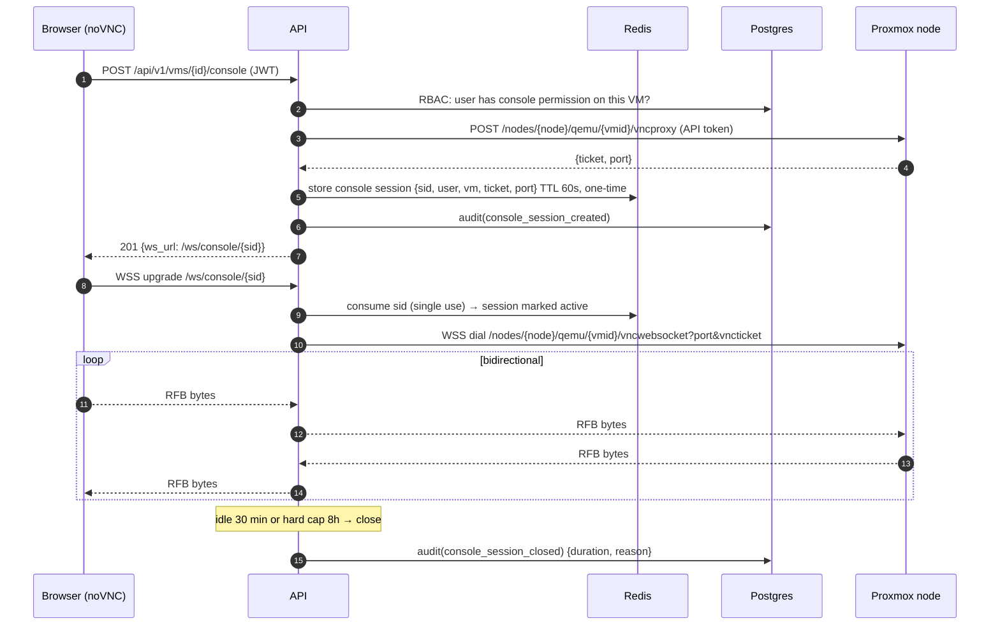

# 06 — Sequence Diagrams

## 6.1 Login (with TOTP) and session issuance

```mermaid
sequenceDiagram
    autonumber
    participant B as Browser
    participant A as API (auth)
    participant PG as Postgres
    participant RD as Redis

    B->>A: POST /api/v1/auth/login {username, password}
    A->>PG: fetch user, argon2id verify
    alt lockout active or bad credentials
        A->>PG: audit(login_failed) + failed_attempt++
        A-->>B: 401 (generic message)
    else TOTP enrolled
        A-->>B: 200 {mfa_required: true, mfa_token}
        B->>A: POST /api/v1/auth/mfa {mfa_token, totp_code}
        A->>A: verify TOTP (±1 step)
    end
    A->>PG: create session row (family_id, refresh_hash)
    A->>PG: audit(login_success)
    A-->>B: 200 {access_token(15m)} + Set-Cookie refresh (httpOnly, 7d)
    Note over B,A: Refresh: POST /auth/refresh rotates the cookie;<br/>reuse of an old refresh token revokes the family (security event)
```

## 6.2 Console access (the critical path)



## 6.3 Inventory sync with change detection & events

```mermaid
sequenceDiagram
    autonumber
    participant S as Scheduler
    participant Q as Asynq (Redis)
    participant W as Worker
    participant C as Proxmox Connector
    participant PG as Postgres
    participant N as Notifier
    participant WS as WS broadcaster

    S->>Q: enqueue sync:inventory:{platform} (unique lock)
    Q->>W: deliver job
    W->>PG: create sync_run(running)
    W->>C: ListVMs / ListHosts / ListStorage / ListNetworks
    C->>C: GET /cluster/resources (1 call) + per-node detail as needed
    C-->>W: normalized assets []
    loop per asset (batched tx)
        W->>PG: upsert; compare content_hash
        alt changed
            W->>PG: asset_state_history += diff
            W->>PG: outbox += vm.state_changed
        end
    end
    W->>PG: mark unseen assets missing; missing×3 → deleted (outbox += vm.deleted)
    W->>PG: sync_run(success, counters)
    W->>Q: publish outbox events → Redis pub/sub
    Q->>N: vm.state_changed → route to channels (email/Slack/webhook)
    Q->>WS: push to subscribed browsers (/ws/events)
    Note over W: on failure: retry w/ backoff (max 5);<br/>circuit breaker per platform; sync.failed event → Notifier
```

## 6.4 Performance metrics collection & alert evaluation

```mermaid
sequenceDiagram
    autonumber
    participant S as Scheduler
    participant W as Worker
    participant C as Connector
    participant TS as TimescaleDB
    participant AL as Alert evaluator
    participant N as Notifier

    S->>W: enqueue metrics:collect:{platform} (every 60s)
    W->>C: CollectMetrics(nodes≤8 parallel)
    C-->>W: samples [vm_id, ts, cpu, mem, disk_io, net_io]
    W->>TS: COPY batch into metrics_vm (hypertable)
    Note over TS: continuous aggregates roll up 5m/30m/3h;<br/>compression after 7d; retention drops per policy
    S->>AL: enqueue alerts:evaluate (every 60s)
    AL->>TS: query last N min rollup per active rule scope
    alt threshold sustained & not in cooldown
        AL->>N: performance_alert(fired, vm, rule, value)
        AL->>TS: alert_state = firing
    else recovered
        AL->>N: performance_alert(resolved)
    end
```

## 6.5 Platform registration & first sync

```mermaid
sequenceDiagram
    autonumber
    participant U as Admin (browser)
    participant A as API
    participant V as Vault(crypto svc)
    participant C as Connector
    participant Q as Queue

    U->>A: POST /platforms/test {url, token, tls}
    A->>C: Connect + Health + Capabilities (nothing persisted)
    C-->>A: version, node count, permission check results
    A-->>U: 200 report (or 422 with precise failure)
    U->>A: POST /platforms {…}
    A->>V: encrypt credential (AES-256-GCM, DEK wrapped by master key)
    A->>A: store platform + credential rows; audit(platform_created)
    A->>Q: enqueue full inventory sync + RRD history backfill (1y)
    A-->>U: 201 {platform}
    Note over U: inventory appears within seconds;<br/>charts have history from backfill
```
