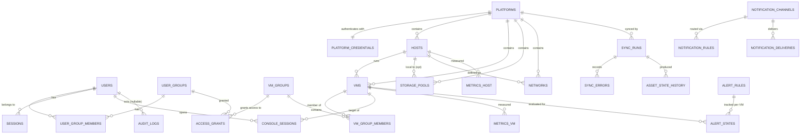

# 07 — Database Design & Entity-Relationship Model

**Engine:** PostgreSQL 16 with TimescaleDB extension. All timestamps `timestamptz` (UTC). All entity PKs are `uuid` (v7 — time-ordered, index-friendly) except high-volume append-only tables which use `bigint identity`. Migrations via goose (plain SQL, forward-only).

**Normalization stance:** core relational data is 3NF. Platform-specific extras that the core never queries live in an `attrs jsonb` column on assets — this is the documented escape hatch that lets connectors store platform detail without schema churn. Anything the core filters/sorts on is a real column.

## 7.1 ER diagram (core entities)



## 7.2 Identity & access

```sql
CREATE TYPE user_role AS ENUM ('admin','operator','readonly','auditor');

CREATE TABLE users (
    id                  uuid PRIMARY KEY,
    username            citext NOT NULL UNIQUE,
    email               citext NOT NULL UNIQUE,
    display_name        text   NOT NULL,
    password_hash       text   NOT NULL,              -- argon2id encoded string
    role                user_role NOT NULL DEFAULT 'readonly',
    is_active           boolean NOT NULL DEFAULT true,
    must_change_password boolean NOT NULL DEFAULT true,
    -- Envelope-encrypted TOTP seed, five columns like every other sealed
    -- secret (migration 00018 replaced the single bytea this originally
    -- reserved, which could not hold a wrapped data key). Present with
    -- totp_enabled false = enrolment started but unconfirmed.
    totp_ciphertext     bytea,
    totp_nonce          bytea,
    totp_dek_wrapped    bytea,
    totp_dek_nonce      bytea,
    totp_key_version    int NOT NULL DEFAULT 1,
    -- Highest RFC 6238 step already accepted, so a code cannot be replayed
    -- inside the ±1-step window it stays arithmetically valid for.
    totp_last_step      bigint,
    totp_enabled        boolean NOT NULL DEFAULT false,
    failed_login_count  int NOT NULL DEFAULT 0,
    locked_until        timestamptz,
    last_login_at       timestamptz,
    created_at          timestamptz NOT NULL DEFAULT now(),
    updated_at          timestamptz NOT NULL DEFAULT now()
);

CREATE TABLE user_groups (
    id          uuid PRIMARY KEY,
    name        citext NOT NULL UNIQUE,
    description text NOT NULL DEFAULT '',
    created_at  timestamptz NOT NULL DEFAULT now()
);

CREATE TABLE user_group_members (
    user_group_id uuid NOT NULL REFERENCES user_groups(id) ON DELETE CASCADE,
    user_id       uuid NOT NULL REFERENCES users(id)       ON DELETE CASCADE,
    PRIMARY KEY (user_group_id, user_id)
);
CREATE INDEX ix_ugm_user ON user_group_members(user_id);

-- Refresh-token sessions. family_id groups rotations; reuse detection revokes the family.
CREATE TABLE sessions (
    id                 uuid PRIMARY KEY,
    user_id            uuid NOT NULL REFERENCES users(id) ON DELETE CASCADE,
    family_id          uuid NOT NULL,
    refresh_token_hash bytea NOT NULL,                -- SHA-256; raw token never stored
    ip                 inet,
    user_agent         text,
    expires_at         timestamptz NOT NULL,
    revoked_at         timestamptz,
    created_at         timestamptz NOT NULL DEFAULT now()
);
CREATE INDEX ix_sessions_user   ON sessions(user_id) WHERE revoked_at IS NULL;
CREATE INDEX ix_sessions_family ON sessions(family_id);
```

**Rationale:** one role per user (RBAC-01) makes the permission model auditable at a glance; group-based *scoping* (below) handles "which VMs", roles handle "which capabilities". `citext` for case-insensitive uniqueness of usernames/emails.

## 7.3 Platforms & credentials (connector tables)

```sql
CREATE TYPE platform_health AS ENUM ('unknown','healthy','degraded','unreachable');

CREATE TABLE platforms (
    id             uuid PRIMARY KEY,
    name           citext NOT NULL UNIQUE,
    type           text   NOT NULL,                   -- connector key: 'proxmox', 'mock', ...
    endpoint_url   text   NOT NULL,
    datacenter     text   NOT NULL DEFAULT 'default', -- UI grouping label
    is_enabled     boolean NOT NULL DEFAULT true,
    tls_mode       text NOT NULL DEFAULT 'verify',    -- verify | custom_ca | fingerprint | insecure
    tls_ca_pem     text,
    tls_fingerprint text,                             -- SHA-256 cert pin
    config         jsonb NOT NULL DEFAULT '{}',       -- connector-specific non-secret config
    sync_intervals jsonb NOT NULL DEFAULT '{"inventory":60,"metrics":60,"health":30}',
    health         platform_health NOT NULL DEFAULT 'unknown',
    health_detail  text,
    last_seen_at   timestamptz,
    detected_version text,
    created_at     timestamptz NOT NULL DEFAULT now(),
    updated_at     timestamptz NOT NULL DEFAULT now(),
    deleted_at     timestamptz                        -- soft delete; assets cascade-soft via app
);

-- Credential storage: envelope encryption. DEK encrypts the secret; master key (env/Docker
-- secret) wraps the DEK. key_version enables master-key rotation without re-entering secrets.
CREATE TABLE platform_credentials (
    id            uuid PRIMARY KEY,
    platform_id   uuid NOT NULL UNIQUE REFERENCES platforms(id) ON DELETE CASCADE,
    kind          text NOT NULL DEFAULT 'api_token',  -- api_token | userpass (future)
    ciphertext    bytea NOT NULL,                     -- AES-256-GCM(secret, DEK)
    nonce         bytea NOT NULL,
    dek_wrapped   bytea NOT NULL,                     -- AES-256-GCM(DEK, master key)
    key_version   int   NOT NULL DEFAULT 1,
    created_at    timestamptz NOT NULL DEFAULT now(),
    rotated_at    timestamptz
);
```

## 7.4 Inventory (assets)

Common asset pattern: `external_id` is the platform's identifier; `(platform_id, external_id)` is the natural key; `content_hash` (SHA-256 of the normalized payload) powers change detection; `sync_state` powers deleted-asset detection; `attrs` holds connector extras.

```sql
CREATE TYPE sync_state AS ENUM ('active','missing','deleted');
CREATE TYPE vm_state   AS ENUM ('running','stopped','paused','suspended','unknown');

CREATE TABLE hosts (
    id            uuid PRIMARY KEY,
    platform_id   uuid NOT NULL REFERENCES platforms(id) ON DELETE CASCADE,
    external_id   text NOT NULL,                      -- Proxmox node name
    name          text NOT NULL,
    status        text NOT NULL DEFAULT 'unknown',    -- online | offline | unknown
    cpu_cores     int,
    memory_bytes  bigint,
    version       text,
    uptime_s      bigint,
    content_hash  bytea NOT NULL,
    sync_state    sync_state NOT NULL DEFAULT 'active',
    missing_count int NOT NULL DEFAULT 0,
    attrs         jsonb NOT NULL DEFAULT '{}',
    first_seen_at timestamptz NOT NULL DEFAULT now(),
    last_seen_at  timestamptz NOT NULL DEFAULT now(),
    deleted_at    timestamptz,
    UNIQUE (platform_id, external_id)
);

CREATE TABLE vms (
    id            uuid PRIMARY KEY,
    platform_id   uuid NOT NULL REFERENCES platforms(id) ON DELETE CASCADE,
    host_id       uuid REFERENCES hosts(id) ON DELETE SET NULL,
    external_id   text NOT NULL,                      -- Proxmox VMID
    name          text NOT NULL,
    vm_type       text NOT NULL DEFAULT 'qemu',       -- qemu | lxc
    state         vm_state NOT NULL DEFAULT 'unknown',
    cpu_cores     int,
    memory_bytes  bigint,
    disk_bytes    bigint,
    uptime_s      bigint,
    ip_addresses  jsonb NOT NULL DEFAULT '[]',        -- from guest agent when available
    platform_tags text[] NOT NULL DEFAULT '{}',       -- synced from platform (read-only)
    portal_tags   text[] NOT NULL DEFAULT '{}',       -- portal-owned, never overwritten by sync
    notes         text NOT NULL DEFAULT '',           -- portal-owned
    content_hash  bytea NOT NULL,
    sync_state    sync_state NOT NULL DEFAULT 'active',
    missing_count int NOT NULL DEFAULT 0,
    attrs         jsonb NOT NULL DEFAULT '{}',
    first_seen_at timestamptz NOT NULL DEFAULT now(),
    last_seen_at  timestamptz NOT NULL DEFAULT now(),
    deleted_at    timestamptz,
    UNIQUE (platform_id, external_id)
);
CREATE INDEX ix_vms_state    ON vms(state)   WHERE deleted_at IS NULL;
CREATE INDEX ix_vms_host     ON vms(host_id) WHERE deleted_at IS NULL;
CREATE INDEX ix_vms_name_trgm ON vms USING gin (name gin_trgm_ops);  -- substring search
CREATE INDEX ix_vms_ptags    ON vms USING gin (portal_tags);

CREATE TABLE storage_pools (
    id            uuid PRIMARY KEY,
    platform_id   uuid NOT NULL REFERENCES platforms(id) ON DELETE CASCADE,
    host_id       uuid REFERENCES hosts(id) ON DELETE SET NULL,  -- NULL = shared/cluster-wide
    external_id   text NOT NULL,
    name          text NOT NULL,
    storage_type  text NOT NULL,                      -- dir, lvm, zfs, ceph, nfs, ...
    total_bytes   bigint,
    used_bytes    bigint,
    is_shared     boolean NOT NULL DEFAULT false,
    content_hash  bytea NOT NULL,
    sync_state    sync_state NOT NULL DEFAULT 'active',
    missing_count int NOT NULL DEFAULT 0,
    attrs         jsonb NOT NULL DEFAULT '{}',
    first_seen_at timestamptz NOT NULL DEFAULT now(),
    last_seen_at  timestamptz NOT NULL DEFAULT now(),
    deleted_at    timestamptz,
    UNIQUE (platform_id, external_id, host_id)
);

CREATE TABLE networks (
    id            uuid PRIMARY KEY,
    platform_id   uuid NOT NULL REFERENCES platforms(id) ON DELETE CASCADE,
    host_id       uuid REFERENCES hosts(id) ON DELETE CASCADE,
    external_id   text NOT NULL,                      -- iface name (vmbr0, bond0, ...)
    name          text NOT NULL,
    net_type      text NOT NULL,                      -- bridge | bond | vlan | eth
    cidr          text,
    vlan_tag      int,
    content_hash  bytea NOT NULL,
    sync_state    sync_state NOT NULL DEFAULT 'active',
    missing_count int NOT NULL DEFAULT 0,
    attrs         jsonb NOT NULL DEFAULT '{}',
    first_seen_at timestamptz NOT NULL DEFAULT now(),
    last_seen_at  timestamptz NOT NULL DEFAULT now(),
    deleted_at    timestamptz,
    UNIQUE (platform_id, host_id, external_id)
);
```

## 7.5 Grouping & grants

```sql
CREATE TABLE vm_groups (
    id          uuid PRIMARY KEY,
    name        citext NOT NULL UNIQUE,
    description text NOT NULL DEFAULT '',
    auto_rule   jsonb,       -- e.g. {"platform_id":"…","match":"pool","value":"prod"} (RBAC-06)
    created_at  timestamptz NOT NULL DEFAULT now()
);

CREATE TABLE vm_group_members (
    vm_group_id uuid NOT NULL REFERENCES vm_groups(id) ON DELETE CASCADE,
    vm_id       uuid NOT NULL REFERENCES vms(id)       ON DELETE CASCADE,
    added_by    text NOT NULL DEFAULT 'manual',        -- manual | auto
    added_at    timestamptz NOT NULL DEFAULT now(),
    PRIMARY KEY (vm_group_id, vm_id)
);
CREATE INDEX ix_vgm_vm ON vm_group_members(vm_id);

CREATE TABLE access_grants (
    id            uuid PRIMARY KEY,
    user_group_id uuid NOT NULL REFERENCES user_groups(id) ON DELETE CASCADE,
    vm_group_id   uuid NOT NULL REFERENCES vm_groups(id)   ON DELETE CASCADE,
    granted_by    uuid REFERENCES users(id) ON DELETE SET NULL,
    created_at    timestamptz NOT NULL DEFAULT now(),
    UNIQUE (user_group_id, vm_group_id)
);
```

**The one visibility query** (used by every VM-scoped read; admins/auditors bypass):

```sql
... WHERE vms.id IN (
    SELECT vgm.vm_id FROM vm_group_members vgm
    JOIN access_grants ag  ON ag.vm_group_id = vgm.vm_group_id
    JOIN user_group_members ugm ON ugm.user_group_id = ag.user_group_id
    WHERE ugm.user_id = $1)
```

## 7.6 Synchronization tables

```sql
CREATE TYPE sync_kind   AS ENUM ('inventory','metrics','health','backfill');
CREATE TYPE sync_status AS ENUM ('running','success','partial','failed');

CREATE TABLE sync_runs (
    id           bigint GENERATED ALWAYS AS IDENTITY PRIMARY KEY,
    platform_id  uuid NOT NULL REFERENCES platforms(id) ON DELETE CASCADE,
    kind         sync_kind NOT NULL,
    status       sync_status NOT NULL DEFAULT 'running',
    trigger      text NOT NULL DEFAULT 'schedule',    -- schedule | manual:{user_id} | retry
    started_at   timestamptz NOT NULL DEFAULT now(),
    finished_at  timestamptz,
    stats        jsonb NOT NULL DEFAULT '{}',         -- {seen, added, changed, missing, deleted, samples}
    error        text
);
CREATE INDEX ix_syncruns_platform ON sync_runs(platform_id, started_at DESC);

CREATE TABLE sync_errors (
    id          bigint GENERATED ALWAYS AS IDENTITY PRIMARY KEY,
    sync_run_id bigint NOT NULL REFERENCES sync_runs(id) ON DELETE CASCADE,
    occurred_at timestamptz NOT NULL DEFAULT now(),
    scope       text NOT NULL,                        -- e.g. 'node:pve2', 'vm:104'
    message     text NOT NULL,
    detail      jsonb NOT NULL DEFAULT '{}'
);

-- Transactional outbox: events written in the same tx as the state change,
-- published to Redis by a relay, marked published. Guarantees no lost events.
CREATE TABLE events_outbox (
    id           bigint GENERATED ALWAYS AS IDENTITY PRIMARY KEY,
    occurred_at  timestamptz NOT NULL DEFAULT now(),
    category     text NOT NULL,      -- sync_failure | vm_state_change | performance_alert | security
    event_type   text NOT NULL,      -- vm.state_changed, vm.deleted, sync.failed, ...
    severity     text NOT NULL DEFAULT 'info',
    payload      jsonb NOT NULL,
    published_at timestamptz
);
CREATE INDEX ix_outbox_unpublished ON events_outbox(id) WHERE published_at IS NULL;
```

## 7.7 Historical & audit tables

```sql
-- Field-level asset change history (INV/SYNC change detection output)
CREATE TABLE asset_state_history (
    id          bigint GENERATED ALWAYS AS IDENTITY,
    changed_at  timestamptz NOT NULL DEFAULT now(),
    asset_type  text NOT NULL,       -- vm | host | storage | network
    asset_id    uuid NOT NULL,
    platform_id uuid NOT NULL,
    sync_run_id bigint,
    field       text NOT NULL,       -- 'state', 'memory_bytes', '_created', '_deleted', ...
    old_value   text,
    new_value   text,
    PRIMARY KEY (changed_at, id)
) PARTITION BY RANGE (changed_at);   -- monthly partitions, 400d retention
CREATE INDEX ix_ash_asset ON asset_state_history(asset_id, changed_at DESC);

CREATE TABLE audit_logs (
    id            bigint GENERATED ALWAYS AS IDENTITY,
    ts            timestamptz NOT NULL DEFAULT now(),
    actor_user_id uuid,               -- NULL = system
    actor_name    text NOT NULL,      -- denormalized: survives user deletion
    category      text NOT NULL,      -- auth | user_mgmt | platform | settings | sync | console | power | notification | api_error
    action        text NOT NULL,      -- login_success, platform_created, console_opened, ...
    target_type   text,
    target_id     text,
    target_name   text,
    source_ip     inet,
    user_agent    text,
    outcome       text NOT NULL DEFAULT 'success',   -- success | failure | denied
    request_id    text,
    details       jsonb NOT NULL DEFAULT '{}',
    PRIMARY KEY (ts, id)
) PARTITION BY RANGE (ts);           -- monthly partitions, 400d retention
CREATE INDEX ix_audit_actor    ON audit_logs(actor_user_id, ts DESC);
CREATE INDEX ix_audit_category ON audit_logs(category, ts DESC);
-- App DB role is GRANTed INSERT+SELECT only on audit_logs (append-only, AUD-03).

CREATE TABLE console_sessions (
    id           uuid PRIMARY KEY,
    user_id      uuid NOT NULL REFERENCES users(id) ON DELETE CASCADE,
    vm_id        uuid NOT NULL REFERENCES vms(id)   ON DELETE CASCADE,
    kind         text NOT NULL DEFAULT 'vnc',       -- vnc | serial
    client_ip    inet,
    started_at   timestamptz NOT NULL DEFAULT now(),
    ended_at     timestamptz,
    close_reason text,                              -- user | idle_timeout | max_duration | admin_forced | error
    bytes_tx     bigint NOT NULL DEFAULT 0,
    bytes_rx     bigint NOT NULL DEFAULT 0
);
CREATE INDEX ix_console_vm   ON console_sessions(vm_id, started_at DESC);
CREATE INDEX ix_console_open ON console_sessions(user_id) WHERE ended_at IS NULL;
```

## 7.8 Metrics (TimescaleDB hypertables)

```sql
CREATE TABLE metrics_vm (
    time           timestamptz NOT NULL,
    vm_id          uuid NOT NULL,
    cpu_pct        real,
    mem_used_bytes bigint,
    mem_total_bytes bigint,
    disk_read_bps  bigint,
    disk_write_bps bigint,
    net_rx_bps     bigint,
    net_tx_bps     bigint,
    disk_used_bytes bigint
);
SELECT create_hypertable('metrics_vm','time', chunk_time_interval => interval '1 day');
CREATE INDEX ix_mvm ON metrics_vm(vm_id, time DESC);
ALTER TABLE metrics_vm SET (timescaledb.compress, timescaledb.compress_segmentby='vm_id');
SELECT add_compression_policy('metrics_vm', interval '7 days');
SELECT add_retention_policy('metrics_vm',  interval '48 hours');   -- raw

-- Continuous aggregates: metrics_vm_5m (30d), metrics_vm_30m (6mo), metrics_vm_3h (400d)
-- each with avg/max per metric; refresh policies every 5m/30m/1h respectively.
-- metrics_host mirrors this shape with cpu_pct, mem, load1, iowait_pct, rootfs_used_bytes.
```

**Sizing check:** 500 VMs × 1 sample/min ≈ 720k rows/day raw (dropped at 48 h); aggregates are ~1/5th, ~1/30th, ~1/180th of that. With compression (~10×), total steady-state ≈ 10–15 GB/year — comfortably a single Postgres instance.

## 7.9 Notifications & alerting

```sql
CREATE TABLE notification_channels (
    id         uuid PRIMARY KEY,
    name       citext NOT NULL UNIQUE,
    kind       text NOT NULL,                        -- email | slack | webhook
    config     jsonb NOT NULL,                       -- non-secret: addresses, url host, template opts
    secret_enc bytea,                                -- envelope-encrypted: SMTP password / webhook HMAC key / Slack URL
    is_enabled boolean NOT NULL DEFAULT true,
    created_at timestamptz NOT NULL DEFAULT now()
);

CREATE TABLE notification_rules (
    id           uuid PRIMARY KEY,
    category     text NOT NULL,                      -- sync_failure | vm_state_change | performance_alert | security
    min_severity text NOT NULL DEFAULT 'info',
    platform_id  uuid REFERENCES platforms(id) ON DELETE CASCADE,   -- NULL = all
    vm_group_id  uuid REFERENCES vm_groups(id) ON DELETE CASCADE,   -- NULL = all
    channel_id   uuid NOT NULL REFERENCES notification_channels(id) ON DELETE CASCADE,
    is_enabled   boolean NOT NULL DEFAULT true
);

CREATE TABLE alert_rules (
    id           uuid PRIMARY KEY,
    name         citext NOT NULL UNIQUE,
    metric       text NOT NULL,                      -- cpu_pct | mem_pct | disk_pct
    op           text NOT NULL DEFAULT '>',
    threshold    real NOT NULL,
    duration_s   int  NOT NULL DEFAULT 600,
    vm_group_id  uuid REFERENCES vm_groups(id) ON DELETE CASCADE,   -- NULL = all VMs
    severity     text NOT NULL DEFAULT 'warning',
    cooldown_s   int  NOT NULL DEFAULT 1800,
    is_enabled   boolean NOT NULL DEFAULT true,
    created_at   timestamptz NOT NULL DEFAULT now()
);

CREATE TABLE alert_states (
    alert_rule_id    uuid NOT NULL REFERENCES alert_rules(id) ON DELETE CASCADE,
    vm_id            uuid NOT NULL REFERENCES vms(id) ON DELETE CASCADE,
    state            text NOT NULL DEFAULT 'ok',     -- ok | firing
    since            timestamptz NOT NULL DEFAULT now(),
    last_notified_at timestamptz,
    PRIMARY KEY (alert_rule_id, vm_id)
);

CREATE TABLE notification_deliveries (
    id          bigint GENERATED ALWAYS AS IDENTITY PRIMARY KEY,
    outbox_id   bigint,
    channel_id  uuid NOT NULL REFERENCES notification_channels(id) ON DELETE CASCADE,
    status      text NOT NULL DEFAULT 'pending',     -- pending | sent | failed
    attempts    int  NOT NULL DEFAULT 0,
    last_error  text,
    created_at  timestamptz NOT NULL DEFAULT now(),
    sent_at     timestamptz
);
```

## 7.10 Configuration

```sql
CREATE TABLE settings (
    key        text PRIMARY KEY,        -- 'console.idle_timeout_s', 'sync.default_interval_s', ...
    value      jsonb NOT NULL,
    updated_at timestamptz NOT NULL DEFAULT now(),
    updated_by uuid REFERENCES users(id) ON DELETE SET NULL
);
-- goose keeps its own goose_db_version table for migrations.
```

## 7.11 Referential-integrity & lifecycle policy summary

| Relationship | On delete | Why |
|---|---|---|
| platform → assets, credentials, sync_runs | CASCADE (platform delete is soft first; hard purge is an explicit admin "purge" action) | keeps orphan-free without accidental mass loss |
| host → vms | SET NULL | VM may migrate nodes between syncs |
| user → sessions, console_sessions | CASCADE | sessions are meaningless without the user |
| user → audit_logs.actor | no FK; denormalized `actor_name` | audit must outlive users |
| asset soft delete | `deleted_at` + `sync_state='deleted'`, purged after 90 days by a janitor job | history/audit references stay resolvable |
