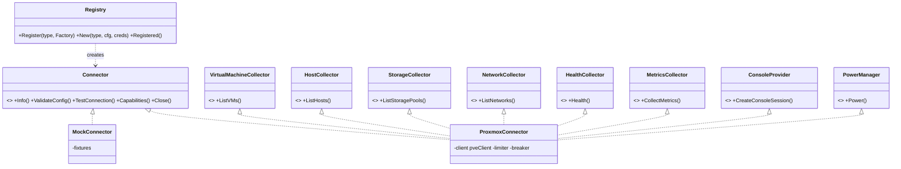

# 09 — Connector Architecture (Plugin Framework)

## 9.1 Goal & approach

Adding a platform (VMware, libvirt, a cloud) must require **only a new connector package** — no changes to domain, application, sync engine, API, or UI code.

**Mechanism: in-process Go interfaces + a compile-time registry.** Each connector is a Go package that registers a factory. The core depends only on the interfaces in `internal/connector` (the *port*); it never imports a concrete connector. The only file that references concrete connectors is a single registration file (`cmd/proxui/connectors.go`) containing blank imports — the Go-idiomatic equivalent of a plugin manifest.

**Rationale — why not dynamic plugins:** Go's `plugin` package is effectively unusable (exact-toolchain matching, no Windows/macOS, cgo). Out-of-process plugins (hashicorp/go-plugin over gRPC) give true drop-in loading but add process management, versioned RPC contracts, and debugging overhead — unjustified when connectors ship with the product and the team is one developer. The interface layer is designed so that an out-of-process adapter could later *implement the same interfaces* over gRPC without touching the core (documented as a future enhancement).

## 9.2 Interface contract

```go
package connector // internal/connector — the port; zero dependencies on app/infra

// Factory registered per platform type.
type Factory func(cfg Config, creds Credentials, opts Options) (Connector, error)

func Register(platformType string, f Factory)   // called from connector packages' init()
func New(platformType string, ...) (Connector, error)
func Registered() []Info

// Connector is the root interface. Optional capabilities are discovered by
// interface assertion — a connector implements only what its platform supports.
type Connector interface {
    Info() Info                              // type, version, display name
    ValidateConfig(cfg Config) error         // static validation before save
    TestConnection(ctx context.Context) (TestReport, error)
    Capabilities() []Capability              // "vm","host","storage","network","console","power","metrics","metrics_backfill","serial_console"
    Close() error
}

type VirtualMachineCollector interface {
    ListVMs(ctx context.Context) ([]VMRecord, error)
}
type HostCollector interface {
    ListHosts(ctx context.Context) ([]HostRecord, error)
}
type StorageCollector interface {
    ListStoragePools(ctx context.Context) ([]StorageRecord, error)
}
type NetworkCollector interface {
    ListNetworks(ctx context.Context) ([]NetworkRecord, error)
}
type HealthCollector interface {
    Health(ctx context.Context) (HealthReport, error)   // cheap; drives platform_health
}
type MetricsCollector interface {
    CollectMetrics(ctx context.Context, scope MetricScope) ([]Sample, error)
}
type MetricsBackfiller interface {                       // optional
    BackfillMetrics(ctx context.Context, vm VMRef, from time.Time) ([]Sample, error)
}
type ConsoleProvider interface {                         // optional
    CreateConsoleSession(ctx context.Context, vm VMRef, kind ConsoleKind) (ConsoleEndpoint, error)
    // ConsoleEndpoint: DialContext() (net.Conn, error) — the proxy pipes bytes, protocol-agnostic
}
type PowerManager interface {                            // optional
    Power(ctx context.Context, vm VMRef, action PowerAction) (TaskRef, error)
}
```

**Normalized records** (`VMRecord`, `HostRecord`, …) are connector-output DTOs: platform-neutral required fields + `Attrs map[string]any` for extras + `NaturalKey()` used for upserts. The sync engine computes `content_hash` over the normalized record — connectors never touch the database.

**Design rules:**
1. Connectors are **stateless between calls** except for connection pooling; all persistence belongs to the core.
2. Connectors **never log secrets** and receive credentials already decrypted, scoped to the call.
3. All methods take `context.Context` and honor cancellation/deadlines (sync engine sets per-call timeouts).
4. Errors are wrapped in typed classes (`connector.ErrAuth`, `ErrUnreachable`, `ErrRefused`, `ErrPermission`, `ErrThrottled`, `ErrNotSupported`) so the sync engine can choose retry vs. circuit-break vs. surface-to-admin.
   The line between `ErrUnreachable` and `ErrRefused` is whether anything answered: a platform that returns 500 was reached, so classifying it as unreachable both sends an operator to debug a healthy network and marks a permanently-failing call retryable. A connector mapping HTTP status onto these classes should send every `>= 500` to `ErrRefused` and keep `ErrUnreachable` for transport failures.
5. A connector declares capabilities honestly; the UI hides buttons (console, power) for platforms lacking them.

## 9.3 Class relationships



## 9.4 The Proxmox connector

| Concern | Implementation |
|---|---|
| Auth | Header `Authorization: PVEAPIToken=user@realm!tokenid=secret`; no ticket lifecycle needed for REST |
| Inventory | `GET /api2/json/cluster/resources` — one call returns all VMs, LXCs, nodes, storage with state and basic metrics. Per-node `GET /nodes/{n}/network` for networks; `GET /nodes/{n}/qemu/{vmid}/config` only on hash change (bounded concurrency 8) |
| VM detail/IPs | `GET /nodes/{n}/qemu/{vmid}/agent/network-get-interfaces` when guest agent present (tolerant of absence) |
| Metrics | `cluster/resources` snapshot each cycle (cpu, mem, disk, netin/out cumulative → rates computed by the engine); per-VM `rrddata?timeframe=hour` fills gaps after portal downtime |
| Backfill | `rrddata?timeframe=day\|week\|month\|year` → up to 1 y of history on registration (PERF-04) |
| Console | `POST …/vncproxy` (websocket=1) → dial `wss://node:8006/…/vncwebsocket?port&vncticket`; returns a `ConsoleEndpoint` whose `DialContext` performs the upstream handshake |
| Power | `POST …/status/{start\|stop\|shutdown\|reboot}` → returns UPID task ref; engine polls task status |
| Health | `GET /version` + `GET /cluster/status` (quorum) |
| Throttling | Client-side limiter 10 req/s per platform; honors 429/5xx with backoff |
| TLS | Per-platform: system CAs / custom CA / SHA-256 pin / insecure (warned + audited) |
| Required token privileges | `PVEAuditor` on `/` minimum; `VM.Console` for console; `VM.PowerMgmt` for power — `TestConnection` verifies via `/access/permissions` and reports what's missing |

## 9.5 The mock connector

Ships in-tree, used by dev environment, integration tests, and the load-test fixture. Configurable fleet size, mutation rate (VMs changing state), failure injection (auth errors, timeouts, partial responses), and a fake console endpoint (echo server). **It is the proof of the plugin contract:** CI runs the entire sync/API/UI test suite against `mock` with zero Proxmox available, demonstrating the core's platform independence.

## 9.6 Adding a new platform — checklist

1. `internal/connectors/<name>/` — implement `Connector` + the collectors the platform supports; register in `init()`.
2. Add blank import in `cmd/proxui/connectors.go`.
3. Add config-schema JSON (drives the auto-generated platform form fields in the UI).
4. Pass the shared **connector conformance test suite** (`connectortest.Run(t, factory)`) — exercises every declared capability against contract rules (idempotent lists, stable natural keys, error typing, context cancellation).
5. Docs page + fixture data for the mock-style tests.

Nothing else changes: sync engine, RBAC, UI, notifications all operate on normalized records and capability flags.
