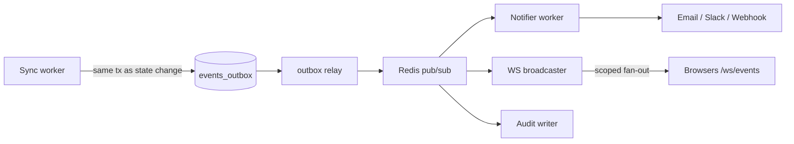

# 10 — Synchronization Engine

## 10.1 Overview

The sync engine turns platform APIs into portal state on a schedule, detecting adds/changes/deletes and emitting events. It is **snapshot-based**: each inventory cycle fetches the platform's current truth and reconciles. Proxmox has no "changed since" API, but `cluster/resources` returns the whole estate in one cheap call, so at ≤ 500 VMs a full snapshot per minute costs less than any incremental bookkeeping would.

**"Incremental sync" here means:** (a) *within* a run, expensive per-asset detail calls happen only for assets whose cheap-snapshot hash changed; (b) metrics gaps after downtime are healed from Proxmox RRD data rather than lost.

## 10.2 Job topology

| Job (Asynq task) | Cadence (default, per-platform configurable) | Purpose |
|---|---|---|
| `sync:health:{platform}` | 30 s | Version/quorum probe → `platform_health`; feeds circuit breaker |
| `sync:inventory:{platform}` | 60 s | Snapshot → reconcile VMs/hosts/storage/networks |
| `sync:metrics:{platform}` | 60 s | Collect samples → hypertables |
| `sync:backfill:{platform}` | on registration / manual | 1-year RRD history import |
| `alerts:evaluate` | 60 s | Threshold rules vs. rollups |
| `outbox:relay` | 2 s poll | Publish `events_outbox` → Redis pub/sub |
| `janitor:daily` | 24 h | Purge soft-deleted assets (90 d), expired sessions, old deliveries; drop expired partitions |

**Scheduling:** the `scheduler` role registers these as Asynq periodic tasks; a Redis lock ensures exactly one active scheduler. **Overlap protection:** task uniqueness key = task type + platform (SYNC-01) — a slow run causes skips, never overlaps. **Parallelism:** platforms sync independently in parallel; within a platform, per-node fan-out uses a bounded worker pool (8); worker containers scale horizontally, Asynq distributes.

## 10.3 Reconciliation algorithm (inventory)

```
run = create sync_run(platform, 'inventory', running)
snapshot = connector.List*()                    # normalized records
seen = set()
for each record (batches of 100, one tx per batch):
    key = (platform_id, natural_key)
    seen.add(key)
    row = SELECT ... FOR UPDATE by key
    if row is null:
        INSERT asset (sync_state=active, first_seen=now)
        history += ('_created'); outbox += asset.created
        apply auto-group rules (pool/tag → vm_group)
    else if row.content_hash != record.hash:
        diff = field-compare(normalized(row), record)
        UPDATE asset SET fields, content_hash, last_seen=now, sync_state=active, missing_count=0
        history += one row per changed field
        if 'state' in diff: outbox += vm.state_changed (category vm_state_change)
    else:
        UPDATE asset SET last_seen=now, missing_count=0   # cheap touch
# deleted-asset detection (mark and sweep):
for row in assets WHERE platform_id=? AND sync_state != 'deleted' AND key NOT IN seen:
    row.missing_count += 1; row.sync_state = missing
    if row.missing_count >= 3:
        row.sync_state = deleted; row.deleted_at = now
        history += ('_deleted'); outbox += vm.deleted (category vm_state_change)
finalize sync_run(success|partial, stats)
```

**Why 3 strikes:** a single missed appearance can be an API hiccup or node timeout; three consecutive misses (~3 min) is a real deletion. `missing` assets render greyed-out in the UI immediately, so operators see the anomaly without a false "deleted" alarm.

## 10.4 Change detection details

- `content_hash = SHA-256(canonical JSON of normalized record)` — computed by the engine, stored per asset; cheap equality test before any field diffing.
- Field diffs recorded per-field in `asset_state_history` (old/new as text) — this is what powers the VM "history" tab and change notifications.
- **Portal-owned fields are excluded from sync writes** (`portal_tags`, `notes`, group memberships added manually). Conflict resolution is therefore trivial and total: *platform wins for platform-derived fields; portal wins for portal-owned fields; the sets are disjoint by design.* No merge logic, no lost updates.

## 10.5 Failure handling

| Failure | Response |
|---|---|
| Transient (timeout, 5xx, conn refused) | Asynq retry: 5 attempts, exponential backoff 10s→3m with jitter; run marked `failed` only after final attempt |
| Auth error (`connector.ErrAuth`) | No retry (won't heal); platform_health=degraded; `sync_failure` event severity=critical → notify admins |
| Partial (one node down, others fine) | Per-node errors recorded in `sync_errors`; run marked `partial`; assets on the dead node handled by mark-and-sweep counters (their absence doesn't immediately delete them) |
| Repeated failure | Circuit breaker per platform: 3 consecutive failed runs → open; scheduled runs skip (logged, cheap); half-open probe every 5 min via health job; close on success. `sync_failure` event on open, `recovered` on close |
| Worker crash mid-run | Batch transactions mean committed batches stand; job re-runs are idempotent upserts; a `sync_run` stuck in `running` > 10 min is marked `failed` by the janitor |
| Clock/rate concerns | Client-side limiter (10 req/s/platform) + honoring upstream 429s keeps the portal a polite API citizen |

## 10.6 Metrics pipeline

1. Collector returns per-VM/per-node samples (Proxmox gives cumulative net/disk counters; the engine keeps the previous counter in Redis and emits rates, handling counter resets on VM restart).
2. Samples buffered and written via `COPY` in one batch per run (≈ 530 rows/min at full scale — trivial).
3. TimescaleDB does the rest declaratively: continuous aggregates (5 m/30 m/3 h), compression after 7 d, retention per policy. The app never runs rollup code.
4. **Gap healing:** if `last sample for platform` is older than 10 min (portal was down), the next metrics run pulls `rrddata?timeframe=hour|day` and backfills the gap before resuming live collection.

## 10.7 Pagination

`cluster/resources` is unpaginated (fine at this scale). The connector contract still requires collectors to internally paginate where a platform needs it (e.g., future VMware/cloud connectors) — `List*` returns the complete set; paging is a connector-internal concern so the engine stays uniform.

## 10.8 Event flow (event-driven sync)



**Rationale (outbox over direct publish):** writing the event in the same transaction as the state change guarantees at-least-once delivery across crashes; Redis pub/sub alone would lose events on restart. Consumers are idempotent (event ids), so at-least-once is safe.
