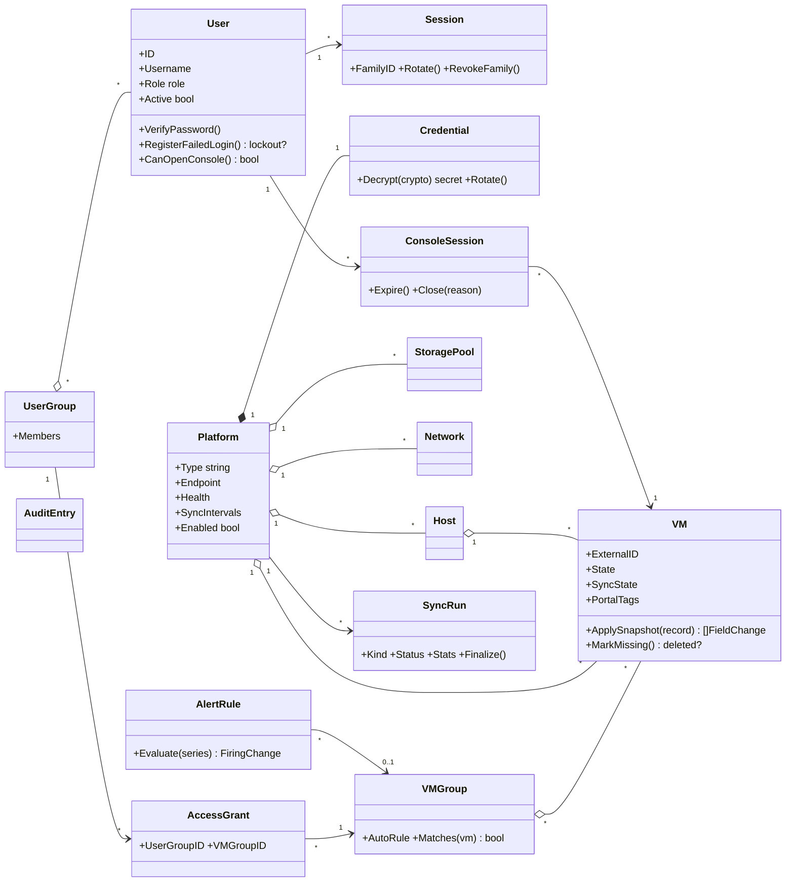

# 12 — Domain Model & Class Diagram

## 12.1 Bounded contexts & ubiquitous language

| Context | Aggregates (root **bold**) | Key invariants |
|---|---|---|
| **Identity** | **User** (Role, Credentials, TotpEnrollment), **Session** (family) | one role per user; lockout after 5 fails/15 min; refresh reuse ⇒ family revoked |
| **Inventory** | **Platform** (Credential, TLSPolicy), **VM**, **Host**, **StoragePool**, **Network**, **VMGroup** | asset identity = (platform, external_id); portal-owned fields never sync-written; sync_state transitions active→missing→deleted only via reconciler |
| **Access** | **UserGroup**, **AccessGrant** | grant links user_group↔vm_group; visibility = union of grants; admin/auditor bypass |
| **Sync** | **SyncRun** (SyncError) | one running run per (platform, kind); runs are immutable once finalized |
| **Telemetry** | Sample streams (no aggregate — append-only) | samples only via reconciler/backfill; range→rollup selection is domain logic |
| **Auditing** | **AuditEntry** | append-only; actor denormalized |
| **Notification** | **Channel**, **RoutingRule**, **AlertRule** (AlertState per VM) | fire once per breach; cooldown; recovery event on clear |
| **Console** | **ConsoleSession** | one-time ticket ≤60 s; bound to (user, vm); idle/max timeouts |

**Glossary:** *Platform* = a connected cluster/endpoint. *Asset* = VM/Host/Storage/Network synced from a platform. *External ID* = the platform's own identifier. *Grant* = user_group→vm_group access link. *Scoped* = filtered by grants. *Outbox event* = domain event persisted transactionally for reliable publication.

## 12.2 Domain events

| Event | Emitted by | Consumers |
|---|---|---|
| `vm.created` / `vm.state_changed` / `vm.deleted` | Reconciler | Notifier, WS broadcaster, auto-grouping |
| `sync.failed` / `sync.recovered` | Sync engine / breaker | Notifier, platform health |
| `alert.fired` / `alert.resolved` | Alert evaluator | Notifier, WS |
| `security.login_failed` / `lockout` / `token_reuse` / `permission_denied` | Identity | Notifier (security category), audit |
| `console.opened` / `console.closed` | Console | Audit |
| `config.changed` | Any admin command | Audit, settings refresher |

## 12.3 Class diagram (core)

## 12.4 Where logic lives (examples)

| Logic | Layer | Why |
|---|---|---|
| "5 failed logins locks 15 min" | `domain/identity.User.RegisterFailedLogin` | pure invariant, unit-testable without DB |
| "which rollup for a 30-day range" | `domain/telemetry.SelectResolution` | pure function used by query handler |
| "missing ×3 ⇒ deleted" | `domain/inventory.VM.MarkMissing` | reconciler calls it; rule testable in isolation |
| Visibility SQL fragment | `app/query` (read model) | performance concern, not an invariant |
| VNC ticket exchange | `connectors/proxmox` | platform-specific by definition |
| Envelope encryption | `infra/crypto` behind `ports.Crypto` | mechanism, not domain |
