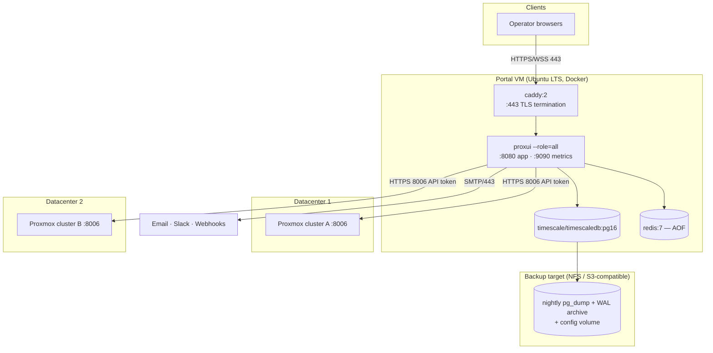

# 14 — Deployment Design (Compose primary, Kubernetes future)

## 14.1 Deployment diagram



## 14.2 Production Compose stack

```yaml
# deploy/compose/docker-compose.yml (abridged — canonical file lives in repo)
services:
  caddy:
    image: caddy:2
    ports: ["443:443"]
    volumes: [./Caddyfile:/etc/caddy/Caddyfile, caddy_data:/data]
  app:
    image: ghcr.io/org/proxui:${VERSION}
    command: ["--role=all"]
    env_file: .env                # DB/Redis URLs, PROXUI_MASTER_KEY_FILE
    secrets: [master_key]
    depends_on: {db: {condition: service_healthy}, redis: {condition: service_healthy}}
    healthcheck: {test: ["CMD","/proxui","healthcheck"], interval: 10s}
    restart: unless-stopped
  db:
    image: timescale/timescaledb:latest-pg16
    volumes: [pg_data:/var/lib/postgresql/data]
    healthcheck: {test: ["CMD-SHELL","pg_isready -U proxui"]}
  redis:
    image: redis:7
    command: ["redis-server","--appendonly","yes"]
    volumes: [redis_data:/data]
secrets:
  master_key: {file: ./secrets/master.key}
```

Operational notes:
- **Upgrade:** `docker compose pull && docker compose up -d` — the app runs goose migrations on start under an advisory lock; images are immutably tagged (`vX.Y.Z`), `latest` never used in prod.
- **Scale-out (if ever needed):** add `app-worker: command: ["--role=worker"]` replicas and switch `app` to `--role=api`; put a second portal VM behind DNS/VIP. No code changes.
- **Network:** only Caddy publishes a port. App→Proxmox egress allow-list (8006/tcp per cluster) enforced at the host firewall. `:9090` metrics reachable only on the Docker network / ops VPN.
- **Sizing:** 4 vCPU / 8 GB RAM / 100 GB SSD covers target scale with 3× headroom.

## 14.3 Backup & disaster recovery

| Item | Mechanism | Schedule | RPO/RTO |
|---|---|---|---|
| Database | `pg_dump -Fc` via `scripts/backup.sh` to NFS/S3 | nightly, keep 30d + 12 monthly | RPO 24 h |
| Database (enhanced) | WAL archiving (`archive_command` → object storage) | continuous | RPO ≤ 5 min |
| Secrets/config | `.env`, `secrets/`, Caddyfile in encrypted off-host copy (updated on change) | on change | — |
| Restore runbook | `scripts/restore.sh` : provision VM → restore dump (+ replay WAL) → start stack → re-verify platform connections | **quarterly drill mandatory** | RTO ≤ 30 min |
| Warm standby (optional) | 2nd VM, streaming replica, manual promotion + DNS flip | continuous | RTO ≤ 30 min, RPO ≈ 0 |

Loss scenarios: portal VM lost → restore on any Docker host (platform credentials come back from the DB; master key from secret backup — **losing both DB and master key means re-entering platform tokens**, an accepted and documented recovery path). Proxmox unreachable → portal degrades per NFR-A4; no portal data loss.

## 14.4 Kubernetes design (future option — not the default)

Documented so the move is mechanical when/if the org standardizes on K8s:

| Component | K8s resource |
|---|---|
| API | `Deployment` (2+ replicas) + `Service` + `Ingress` (nginx/Traefik, TLS via cert-manager); HPA on CPU + custom `http_inflight` metric; `PodDisruptionBudget minAvailable: 1` |
| Workers | `Deployment` (2+), HPA on Asynq queue depth (KEDA Redis scaler) |
| Scheduler | part of worker Deployment — Redis lock already guarantees singleton (no Lease needed) |
| Postgres+Timescale | CloudNativePG operator (1 primary + 1 replica, scheduled base backups + WAL to S3) — or external managed PG |
| Redis | Bitnami chart standalone + AOF PVC (queue tolerates brief outage; Sentinel unnecessary) |
| Secrets | External Secrets Operator ← Vault/SOPS; master key as mounted Secret |
| Migrations | init container on API (same advisory-lock guard) |
| Console WS | Ingress with `proxy-read-timeout: 3600`; sticky sessions **not** required (session state in Redis; any API pod can serve the bridge because the console `sid` is looked up in Redis) |
| Config | Helm chart in `deploy/k8s/chart` mirroring Compose env contract exactly |

**Why not now:** one VM and four containers serve 50 users; K8s would add a control plane to operate for zero functional gain. The app is 12-factor (env config, stateless API, queue workers), so nothing in the code cares which orchestrator runs it — that is the honest meaning of "microservice-ready" here.

## 14.5 Environments

| Env | Purpose | Stack |
|---|---|---|
| `dev` | local | `make dev`: Compose (db, redis) + `go run --role=all` + Vite dev server + mock connector seeded |
| `staging` | pre-prod validation | same Compose as prod on a small VM, mock + one real test cluster |
| `prod` | live | as above |

Promotion is by image tag; configuration differs only via `.env` — never by build.

## 14.6 Node prerequisites

The stack above is the whole portal. The Proxmox nodes are not part of it, and
the portal does not own them — but three of its features run *on* a node rather
than against the API, because Proxmox has no API for what they do. Each of them
needs something installed there.

| On each node | Needed by | Portal can install it |
|---|---|---|
| the portal's public key in `root`'s `authorized_keys` | everything below | **no** — installing it needs the access it grants |
| `lm-sensors` (`sensors`) | node temperatures — Proxmox publishes none (§30) | yes |
| `libguestfs-tools` (`virt-customize`) | putting a guest agent into a template's disk (PROV-14) | yes |

None of these is a hard requirement. A node without the key is the normal
starting state and stays quiet about it; a node without `lm-sensors` reports no
temperature; a node without `libguestfs-tools` still builds templates, whose
guests simply arrive with no agent and therefore no IP address in the inventory.

That is exactly why they need saying out loud. Nothing fails — you find out
later, from a chart with no line on it or a guest the portal cannot offer a
terminal to.

**Checking and fixing from the portal.** A platform's detail drawer has a
**Readiness** section: it asks every node what it has, and offers to install the
two packages it can. Admin-only, confirmed, and audited as `node.install`
naming the node and the packages
([ADR 0011](adr/0011-the-portal-can-install-what-it-needs-on-a-node.md)). The
package list is a constant in the binary — the request names a prerequisite,
never a package.

The SSH key is checked and deliberately not offered: see §30.2 for the two
commands, which an operator runs once per node.

**Token privileges** are reported in the same place, because they are the other
half of the same question. The credential's own privileges decide whether the
platform can provision and whether it can build templates, and widening them is
done on the cluster, in **Datacenter → Permissions**, not from here.

**A new site,** then, is: bring up the stack, add the platform, press
**Check readiness**, and do what it says. That is what "standard on any
deployment" can honestly mean for machines the portal is only a guest on.
