# 19 — CI/CD Pipeline

Platform: **GitHub Actions** (swap-friendly: all logic lives in `Makefile` targets; workflows only orchestrate). Trunk-based development: short-lived branches → PR → squash-merge to `main`; `main` is always releasable.

## 19.1 Pipeline overview

```mermaid
flowchart LR
    subgraph PR["ci.yml — every PR & push to main"]
        A[lint\ngolangci-lint · eslint\ndepguard layer check] --> B[gen-check\nsqlc/oapi/TS current]
        B --> C[unit tests -race\ndomain + app]
        C --> D[integration\ntestcontainers PG+TS, Redis]
        D --> E[API e2e + RBAC matrix\nbinary + mock connector]
        E --> F[frontend\nvitest + playwright golden paths]
        F --> G[security scans\ngovulncheck · npm audit · gitleaks · Trivy]
        G --> H[docker build + boot smoke]
    end
    subgraph REL["release.yml — tag v*"]
        I[full CI] --> J[build multi-arch image\namd64/arm64, SBOM, cosign sign]
        J --> K[push ghcr.io immutable tag]
        K --> L[auto-deploy staging\nssh compose pull+up]
        L --> M[staging smoke + ZAP baseline]
        M --> N{manual approval}
        N --> O[deploy prod\nssh compose pull+up]
        O --> P[post-deploy verify\n/readyz · sync green · login probe]
    end
    subgraph NIGHT["nightly.yml"]
        Q[load test 2000 VMs\nk6 NFR assertions]
        R[upgrade-path migration test]
        S[optional: conformance vs real PVE lab]
        T[dependency update PRs]
    end
    H -.-> I
```

## 19.2 Stage details

| Stage | Notes |
|---|---|
| Lint & layers | golangci-lint with `depguard` enforcing Clean Architecture imports; fails on new warnings (no baseline drift) |
| Gen-check | `make gen && git diff --exit-code` — the OpenAPI/sqlc contract can't silently drift from code |
| Tests | as defined in [18-testing-strategy.md](18-testing-strategy.md); parallel jobs; testcontainers images pinned by digest; total PR wall-time budget **< 10 min** (hard requirement — slow CI kills solo-dev flow) |
| Image build | multi-stage Dockerfile (node build → go build CGO_DISABLED → distroless nonroot); version + commit baked via ldflags; SBOM (syft) attached; cosign keyless signing |
| Versioning | SemVer git tags drive releases; `main` builds also push `edge` image for staging experiments; CHANGELOG generated from conventional commits |
| Staging deploy | GitHub Environments with SSH deploy key; `docker compose pull && up -d`; migrations run on boot (advisory lock) |
| Prod deploy | manual approval gate (GitHub Environment protection); same mechanism; **rollback** = redeploy previous tag (migrations are forward-only + expand/contract, so N−1 binary always runs on N schema) |
| Post-deploy | scripted probe: `/readyz`, login with probe account, platform sync freshness, console ticket dry-run |

## 19.3 Secrets in CI/CD

Only deploy SSH keys and the optional lab-cluster token live in GitHub Environments (protected, OIDC-scoped). No production application secrets ever enter CI — the app pulls its secrets from the host's `.env`/Docker secrets at runtime. gitleaks blocks accidental commits.

## 19.4 Branch & review policy (solo-dev pragmatic)

- PRs required even solo (CI gate + AI review pass — see [23-ai-native-development.md](23-ai-native-development.md)); self-merge allowed when green.
- `main` protected: no force-push, CI required.
- ADRs (`docs/adr/`) required for decisions that deviate from this design package — the package stays truthful over time.
